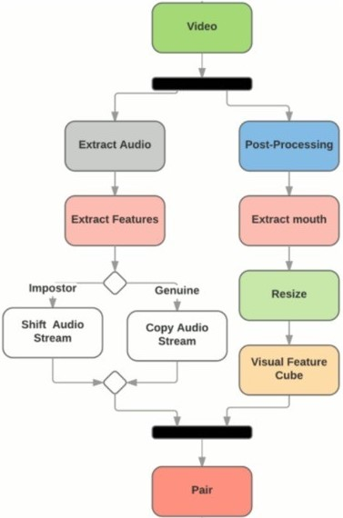

# LipSenseAI-SpeechRecognition
**Project Title:** Silent Speech Recognition: Automatic Lip Reading Model Using 3D CNN And GRU

**Project ID:** SPS_PRO_4000

**Team Members:**
- Md. Anas Jamal
- Radha Krishna Garg

**Project Description:**
The "Silent Speech Recognition: Automatic Lip Reading Model Using 3D CNN And GRU" project is aimed at developing an advanced system that can recognize and interpret silent speech by analyzing lip movements. This innovative approach combines the power of 3D Convolutional Neural Networks (CNN) and Gated Recurrent Units (GRU), allowing the model to effectively process and interpret the dynamic visual cues of lip movements for silent speech recognition.

**Project Architecture:**
 

 

**Project Purpose:**
The primary purpose of this project is to harness cutting-edge artificial intelligence techniques to enable silent speech recognition, which has a wide range of applications, including but not limited to:

1. **Accessibility Enhancement:** The system can greatly improve accessibility for individuals with hearing impairments, helping them understand spoken language by analyzing lip movements.

2. **Communication in Noisy Environments:** In noisy environments, such as factories or crowded public spaces, traditional speech recognition may fail. This system can provide an alternative means of communication by focusing on lip reading.

3. **Integration with Virtual Assistants:** Silent speech recognition can be seamlessly integrated with virtual assistants like IBM Watson, making voice-based interactions more robust and reliable.

4. **Telecommunications:** This technology can enhance telecommunications by enabling clear communication in situations with poor audio quality.

5. **Security Systems:** Silent speech recognition can be integrated into security systems to identify unauthorized individuals by analyzing their lip movements.

By combining 3D CNN and GRU, our project aims to push the boundaries of what is possible in silent speech recognition and contribute to the development of practical and impactful AI applications.

**Project Approach:**
The project will involve the following key steps:

1. **Data Collection:** Gather a diverse dataset of individuals speaking various phrases silently while recording their lip movements.

2. **Data Preprocessing:** Prepare the data by extracting frames, aligning lip movements, and dividing it into training and testing sets.

3. **Model Development:** Build a deep learning model that combines 3D CNN layers to capture spatiotemporal features from lip movements and GRU layers to understand the sequential patterns in speech.

4. **Training and Validation:** Train the model on the prepared dataset and validate its performance using appropriate metrics.

5. **Integration:** Develop a user-friendly interface to interact with the model, making it accessible to the target applications.

6. **Testing and Optimization:** Test the system in various real-world scenarios, fine-tune the model, and optimize its performance.

7. **Deployment:** Once the model is reliable and robust, deploy it for practical applications, such as accessibility tools, communication devices, and security systems.

**Expected Outcomes:**
The expected outcomes of this project include:

- A highly accurate and efficient silent speech recognition system.
- Improved accessibility and communication for individuals with hearing impairments.
- Enhanced communication capabilities in noisy environments.
- Integration with virtual assistants, telecommunications, and security systems.
- A strong contender for the IBM Hack Challenge 2023, demonstrating the potential of AI in the field of speech recognition and accessibility.

The "Silent Speech Recognition: Automatic Lip Reading Model Using 3D CNN And GRU" project holds great promise for making strides in AI-driven speech recognition and addressing real-world challenges in accessibility, communication, and security.
